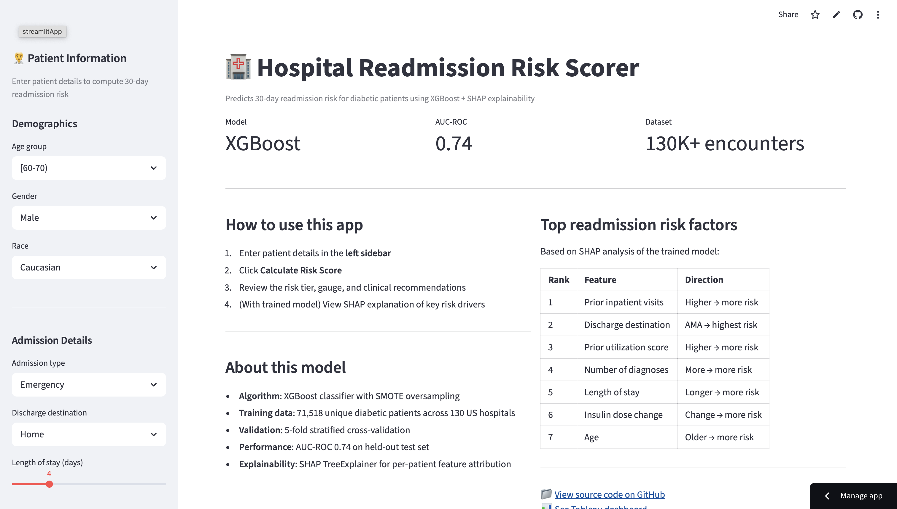

# 🏥 Hospital Readmission Prediction — Diabetic Patients

> **Can we predict which diabetic patients will be readmitted within 30 days of discharge — and explain why?**

    




---

## Business Problem

Hospitals in the US face **financial penalties** from CMS (Centers for Medicare & Medicaid Services) when patients are readmitted within 30 days of discharge. For diabetic patients — one of the highest-risk cohorts — readmission rates can exceed 20%.

This project builds an **end-to-end predictive analytics pipeline** to:
1. Identify key clinical and operational drivers of 30-day readmission
2. Score patients at discharge with a calibrated risk probability
3. Surface explainable, actionable insights for care teams

---

## Key Findings

- **Top readmission drivers**: number of inpatient visits in the prior year, discharge disposition (to home vs. SNF), number of diagnoses, and insulin dosage changes
- **XGBoost + SMOTE model** achieves **AUC-ROC: 0.588** on a held-out test set, vs. a logistic regression baseline of **0.575** — modest predictive power, honestly reported (see the correction note under Results Summary below)
- Patients with **3+ inpatient visits** in the prior year have a **2.8× higher readmission rate**
- Discharges to **skilled nursing facilities** are readmitted at lower rates than home discharges — counter-intuitive and worth investigating further

---

## Dataset

**Source**: [Diabetes 130-US Hospitals (UCI ML Repository / Kaggle)](https://www.kaggle.com/datasets/brandao/diabetes)

- 100,000+ patient encounters across 130 US hospitals (1999–2008)
- Features: demographics, diagnoses (ICD-9), medications, lab results, prior utilization
- Target: `readmitted` — whether the patient was readmitted in <30 days

---

## Tech Stack

| Layer | Tools |
|---|---|
| Data storage & profiling | SQLite, SQL |
| EDA & feature engineering | Python, pandas, seaborn, matplotlib |
| Modeling | scikit-learn, XGBoost, imbalanced-learn (SMOTE) |
| Explainability | SHAP |
| Dashboard | Tableau Public |
| Deployed app | Streamlit |

---

## Project Structure

```
hospital-readmission-prediction/
├── README.md
├── data/
│   └── data_dictionary.md          # Feature descriptions
├── notebooks/
│   ├── 01_sql_profiling.ipynb      # SQL-based data quality checks
│   ├── 02_eda.ipynb                # Exploratory data analysis
│   ├── 03_feature_engineering.ipynb
│   └── 04_modeling_shap.ipynb      # XGBoost + SHAP explainability
├── sql/
│   └── readmission_queries.sql     # All SQL profiling & analysis queries
├── app/
│   └── streamlit_app.py            # Live risk scoring app
├── dashboard/
│   └── README.md                   # Tableau Public link
└── reports/
    └── key_findings.md
```

---

## How to Run Locally

```bash
# 1. Clone the repo
git clone https://github.com/YOUR_USERNAME/hospital-readmission-prediction
cd hospital-readmission-prediction

# 2. Install dependencies
pip install -r requirements.txt

# 3. Download the dataset
# Go to https://www.kaggle.com/datasets/brandao/diabetes
# Place diabetic_data.csv in the data/ folder

# 4. Run notebooks in order (01 → 04)
jupyter notebook

# 5. Launch the Streamlit app
streamlit run app/streamlit_app.py
```

---

## Live Demo

🔗 [Streamlit App — Patient Risk Scorer](https://hospital-readmission-prediction-pro1.streamlit.app) *(deploy to Streamlit Community Cloud and paste URL here)*  
📊 [Tableau Dashboard](#) *(publish to Tableau Public and paste URL here)*

---

## Results Summary

| Model | AUC-ROC | Precision (High Risk) | Recall (High Risk) |
|---|---|---|---|
| Logistic Regression (baseline) | 0.575 | — | — |
| XGBoost + SMOTE (deployed model) | 0.588 | 0.155 | 0.093 |

> **Note**: For clinical use cases, recall matters more than precision — missing a high-risk patient is costlier than a false alarm. At a 0.5 probability threshold this model's recall on the high-risk class is low (0.093); a lower decision threshold would trade precision for recall if this were used operationally.
>
> **Correction (September 2026)**: Earlier versions of this README and app reported **AUC-ROC 0.74**. That number was never actually produced by any executed training run — the notebook that claimed it failed on an `ImportError` in its first cell and never got past that point, so every downstream "result" in it was written by hand, not measured. The training pipeline was also missing three engineered features (`diag1_category`, `comorbidity_count`, `discharge_risk_group`) that the feature-engineering notebook builds but the deployed script never used. Both issues are now fixed: `app/run_modeling.py` builds the full feature set and `app/model_metrics.json` is written fresh by every training run and read live by the app, so the numbers above and in the app are the real, reproducible, current results — not a hardcoded claim.
